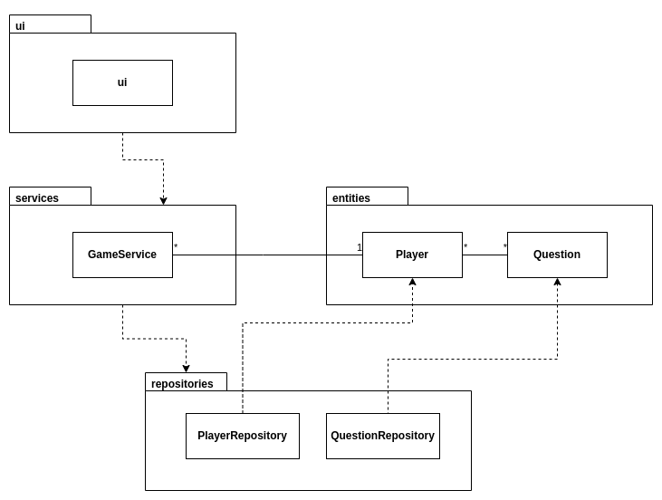
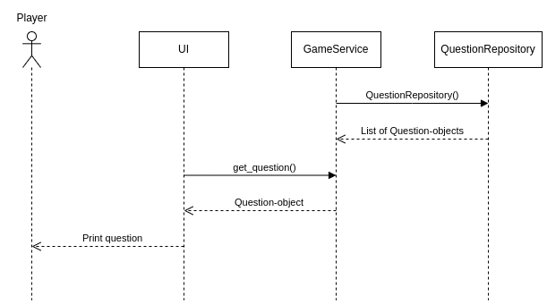

# Arkkitehtuurikuvaus

## Sovelluslogiikka

## Tietojen pysyväistallennus

Pakkauksen repositories-luokat ovat vastuussa tietojen tallennuksesta. QuestionRepository vastaa pelin kysymyksien hallinnasta. Kysymyksiä säilytetään csv-tiedostossa. PlayerRepository vastaa pelin pelaajien hallinnasta. Pelaajien tietoja säilytetään SQLite-tietokannassa. 

## Päätoiminnallisuudet

### Kysymysten haku

Ohjelman käynnistyessä GameService hakee kaikki kysymykset tietokannasta. Kysymykset tallennettaan Question-olioina listaan. Käyttöliittymästä kutsutaan sitten get_question-metodilla yksittäisiä kysymyksiä, jotka esitetään pelaajalle. 

