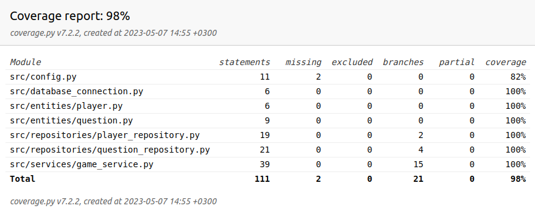

# Testausdokumentti

Sovelluksen testaus on hoidettu automatisoiduin yksikkö -ja integraatiotestein unittestilla. Tämän lisäksi sovellusta on testattu manuaalisesti pelaajan näkökulmasta ja erikseen virtuaaliympäristössä. 

## Yksikkö- ja integraatiotestaus

### Testit

Valtaosa testeistä sijaitsee [TestGameService](../src/tests/game_service_test.py)-testiluokassa. Tällä testataan suoraan `GameService`-luokkaa, joka on vastuussa sovelluslogiikasta. `GameService`-luokka kutsuu repositorio-luokkia `PlayerRepository` ja `QuestionRepository`. Vastaavasti repositorio-luokat kutsuvat entity-luokkia `Player`ja `Question`. Näin ollen sovelluslogiikasta vastaavan luokan metodien testaaminen testaa samalla myös repositorio- ja entity-luokkia. Repositorio-luokkien käyttämät tiedostot on konfiguroitu .env.test-tiedostoon. 

Käyttöliittymäluokka UI on jätetty automatisoitujen testien ulkopuolelle. 

### Testauskattavuus

Sovelluksen testauksen haarautumakattavuus on 98%

## Järjestelmätestaus

Sovelluksen järjestelmätestaus on suoritettu manuaalisesti.

### Asennus ja toiminnallisuudet

Sovelluksen [käyttöohje](./kayttoohje.md) ja [vaatimusmäärittely](./vaatimusmaarittely.md) antaa ohjeet sovelluksen asentamiseen ja itse pelin kulkuun. Manuaalinen testaus on tehty Linux-ympäristössä noudattaen pelin kulkua ja testaten pelin eri vaiheita ja toiminnallisuuksia erilaisilla syötteillä. 

## Sovellukseen jääneet laatuongelmat

- Tiedostossa valmiina olevat kysymykset ovat luotu käyttäen apuna ChatGPT:ta, joten kysymysten laadussa on parantamisen varaa
    - Monet kysymykset ovat varsin helppoja 
    - Jotkin kysymykset saattavat olla vain hieman eri muodossa
    - Kysymyksiä voisi olla enemmän
