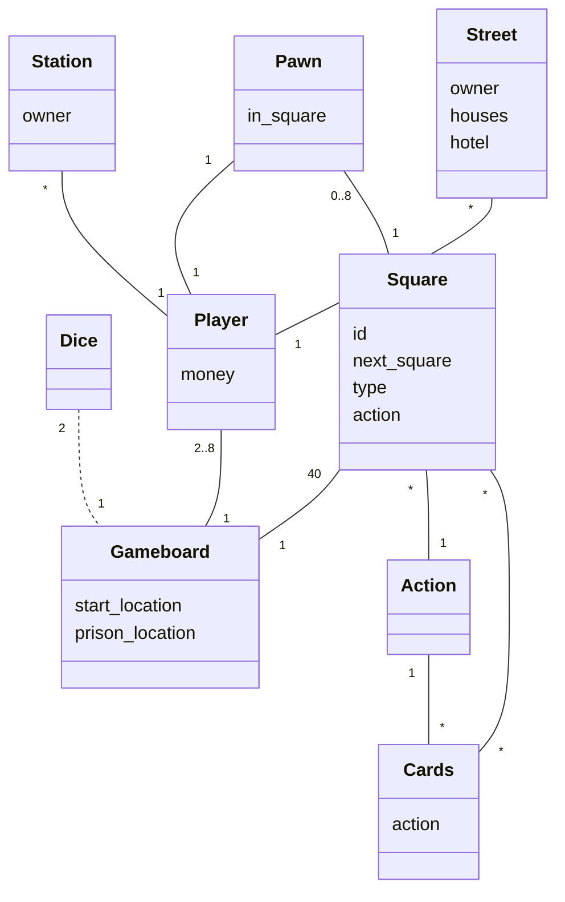

```mermaid
 classDiagram
     
      Dice "2" .. "1" Gameboard
      class Dice{
      }
      Player "2..8" -- "1" Gameboard
      
      class Player{
          money
      }
      class Gameboard{
      start_location
      prison_location
      }
      Square "40" -- "1" Gameboard
      class Square{
          id 
          next_square
          type
          action
      }
      Pawn "1" -- "1" Player
      Pawn "0..8" -- "1" Square
      class Pawn{
          in_square
      }
      Square "*" -- "1" Action
      class Action{
      }
      Square "*" -- "*" Cards
      Action "1" -- "*" Cards
      class Cards{
          action
      }
      Station "*" -- "1" Player
      class Station{
          owner
      }
      Street "*" -- "1" Player
      class Street{
          owner
          houses
          hotel
      }


```
