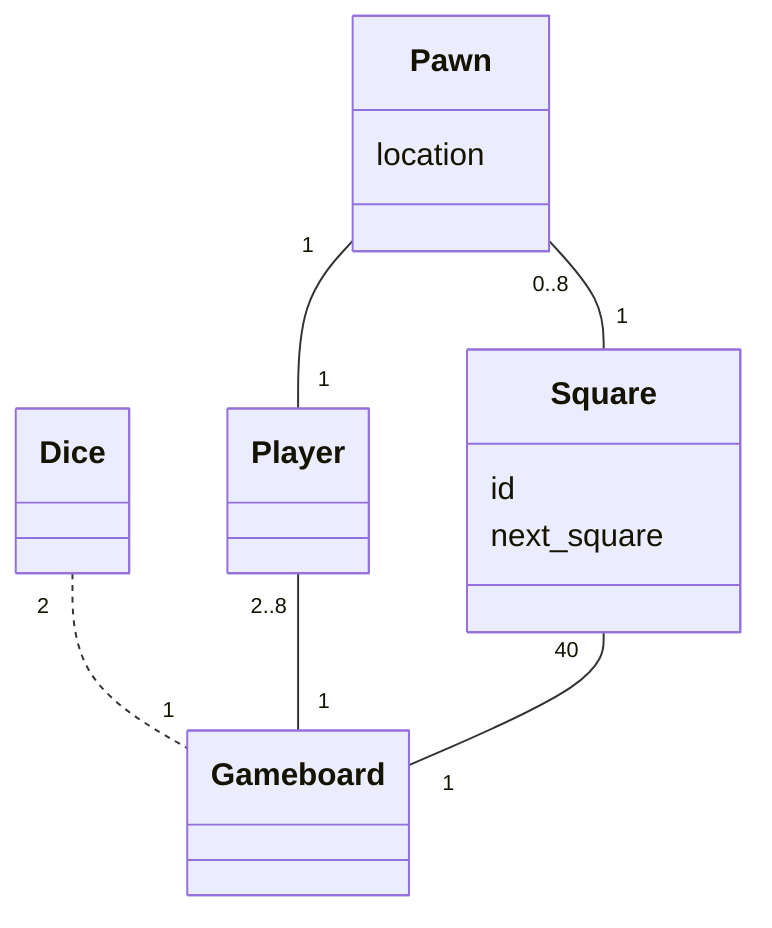

```mermaid
 classDiagram
     
      Dice "2" .. "1" Gameboard
      class Dice{
      }
      Player "2..8" -- "1" Gameboard
      
      class Player{
      }
      class Gameboard{
      }
      Square "40" -- "1" Gameboard
      class Square{
          id 
          next_square
      }
      Pawn "1" -- "1" Player
      Pawn "0..8" -- "1" Square
      class Pawn{
          location
      }


```
